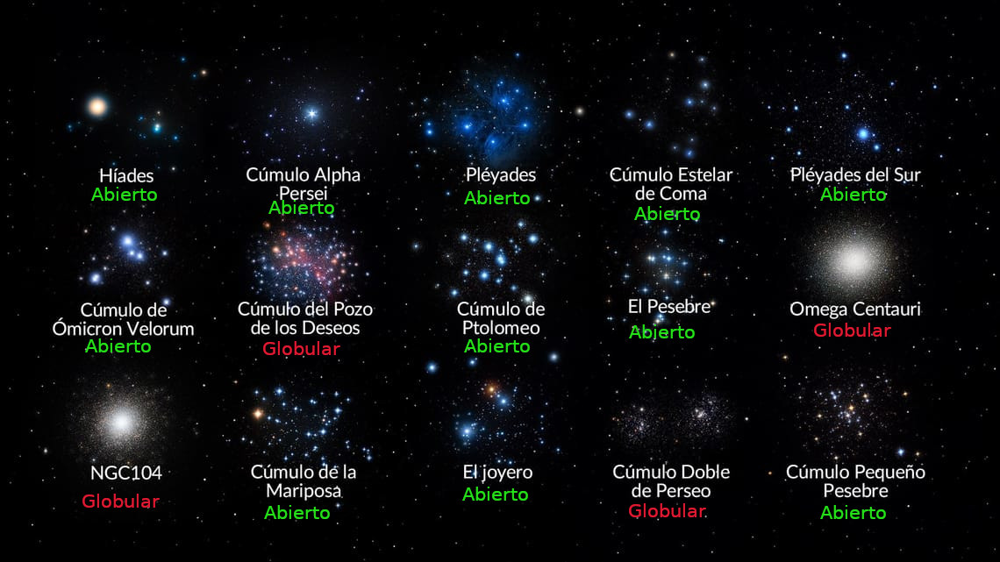

# Proyecto Final: Stellar Association Recognition System (STARS)
## Objetivo
Este proyecto tiene como objetivo, a partir de la introducción de una lista de estrellas, encontrar agrupaciones de las mismas en base a sus características astrofísicas (tales como edad, movimiento propio, coordenadas espaciales, tipo espectral...) y, posteriormente se categorizarán estas estructuras en cúmulos abiertos o cerrados. Para ello se divide el problema en dos partes:
1. Problema de clustering: construir un modelo de clustering que agrupe apropiadamente las estrellas en base a las características más relevantes.
2. Problema de RNA: construir un modelo que sea capaz de diferenciar cúmulos abiertos o globulares. (Ver Figura 1)

## 1. Obtención de datos
Los datos podrán buscarse en la base de datos VizieR (https://vizier.cds.unistra.fr/viz-bin/VizieR). Este es un portal donde se alojan de forma gratuita los datasets que los científicos usan para sus investigaciones. Los datos generalmente provienen de satélites y observatorios que hacen observaciones del cielo bucando objetos concretos. Algunas misiones se centran en galaxias, otras en supernovas, etc. En nuestro caso estamos buscando datos de estrellas concretas.

El mejor catálogo de estrellas actualmente es el obtenido por la misión Gaia, que en su última actualización es Gaia DR3. Esta misión mapea nuestra galaxia y obtiene características de cada estrella indicidual. En algunos casos estos datos serán más factibles de obtener y en otros casos la estrella está en un entorno de polvo o luz que no permite que se tome la medida. Actualmente este catálogo cuenta con casi 2millones de estrellas mapeadas. 

Para escoger estrellas que pertenezcan a cúmulos, ya sean abiertos o cerrados, nos fijaremos en trabajos previos de investigadores que hayan hecho una selección aproximada de estrellas para uno o varios cumulos en concreto. 
1. Tomaremos de sus samples de datos las coordenadas de las estrellas y el cúmulo al que pertenecen.
2. Unificaremos todas las estrellas en un únido dataset.
> Esto está en Clusters.csv
3. Unificaremos los nombres de los cúmulos, ya que puede estar el mismo cumulo repetidamente, con nombres diferentes. Para ello:
   1. Haremos una tabla de equivalencia de nombres en los diferentes catálogos.
   > Esta tabla es NamesCatalogEquivalence.csv
   2. Unificaremos los nombres de nuestras estrellas bajo el mismo catálogo.
   > Esto está recogido en RenamedClusters.csv
4. Cruzaremos nuestras estrellas con la base da datos de Gaia DR3 usando el software TopCat, específico para hacer Astronomical Data Query Language (ADQL)
> Esto está en STARSSample.csv

5. Tambien se contruye una tabla de características generales de cada cúmulo (ClustersInfo) que servirá para el tratamiento de valores nulos y outliers. Se le aplica el mismo tratamiento a los nombres de los clusters.
> Esto está en ClustersInfo_clean.csv

> Este trabajo está hecho en BuildData.ipynb

## 2.EDA

Comenzaremos el EDA haciendo una exploración general del dataset para luego pasar a hacer el tratamiento de outliers cúmulo a cúmulo. Nuestra target es la columna 'Clusters', siendo el resto de columnas las predictoras.

### 2.2 Exploración general
En BuildData se encuentra la descripción de las columnas de nuestro dataset. A partir de aqui:

1. Se eliminan la columnas repetidas
2. Se elimnan las predictoras que estamos seguros que son innecesarias para nuestro objetivo
3. Se realiza el tratamiento de valores nulos
4. Se hace una limpieza general de datos en base a algunas columnas
5. Se factorizan las columnas categóricas y se guardan las tablas de equivalencia

> Este trabajo se realizará en BuildData
> El sample resultado de estos cambios se guarda como '../Samples/PostEDA/STARS_PreCleaned.csv'
> Las tablas de equivalencia de las categóricas se guarda como '../Samples/Auxiliar/NombreVariable_Factorization.csv'

### 2.3 Tratamiento de outliers
Dado que en nuestro dataset tenemos datos de diferentes cúmulos que se encuentran en diferentes lugares de nuestra galaxia, no tiene sentido hacer la búsqueda de outliers teniendo en cuenta todo el dataset en su conjunto. Por ello:
1. Dividiremos el dataset inicial por cúmulos.
2. Estudiaremos los outliers en cada grupo por separado.
3. Rearmaremos el dataset.

#### 2.3.1 Búsqueda de outliers
Dado que los cúmulos son grupos de estrellas que se formaron más o menos a la vez a partir de a misma nube de gas, las estrellas que lo componen compartirán (ordenados de mayor a menor concordancia):
- Edad: todas tendrán una edad similar.
- Movimientos propios: todas se moverán más o menos de la misma forma alrededor del centro galáctico. Para estudiar esto se usa pmRA y pmDE.
- Metalicidad: ya que todas han nacido a partir de la misma nube, todas tendrán más o menos la misma proporción de cada elemento químico. Sin embargo esto no tiene porque sé cumplirse si se han formado estrellas de masas diferentes que producirán elemenos pesados a diferentes ritmos.
- Masa: todas tendrán una masa similar.
- Luminosidad y color: si las estrellas tienen una masa similar, tendrán también una luminosidad y un color similares.
- Posición: todas las estrellas tendrán una posición parecida. Sin embargo esto es más acertado para cúmulos globulares, ya que las estrellas están muy juntas, que para cúmulos abiertos, donde las estrellas han podido disgregarse mucho.

Es posible que en nuestra selección de estrellas tengamos estrellas que aparentemente pertenecen el grupo del cúmulo, pero que en realidad no es hermana del resto. Estas estrellas infiltradas aparecerán como outliers en las variables antes descritas y el tratamiento correcto es la eliminación del dataset.

> Para este trabajo (repetitivo con cada grupo), podemos hacerlo una vez para un cúmulo, poniendo todo bonito y las gráficas chulas y eso luego usar eso para hacer una librería que usar con el resto de cúmulos para ahorrar trabajo.

## Datasets

1. Clusters: contiene una lista de estrellas con sus coordenadas y el cúmulo al que pertenecen. Se ha construido en el paso 1, puntos 1 y 2.
2. NamesCatalogEquivalence: tabla con el nombre de cda cumulo en diferentes catálogos. Se ha construido en elpaso 1, punto 3. Se usa para renombrar los clusters y tenerlos todos siempre nombrados igual.
3. RenamedClusters: es el dataset Clusters habiendo cambiado los nombres de los clusters mediante la tabla NamesCatalogEquivalence. Se ha construido en elpaso 1, punto 3.
4. STARTSSample: es nuestro dataset inicial. Es el resultado de añadir todas las características de las estrellas a RenamedClusters mediante la herramiento TopCat. Se ha construido en elpaso 1, punto 4.
5. ClustersInfo: es una tabla de características generales de cada cúmulo. Es como tener 'la media' de las caracteristicas de todas las estrellas que componen cada cumulo. Se construye fuera del repo.
6. ClustersInfo_clean: es el resultado de renombrar los clusters y arreglar el formato de ClustersInfo. Se construye en el paso 1, punto 5. Se usará en el tratamiendo de valores nulos y outliers.

## Apéndice 1: Menciones
- LAMOST candidate members of star clusters (Xiang+, 2015)
- APOGEE stars members of 35 star clusters (Garcia-Dias+, 2019)
- Candidate members of star clusters from LAMOST DR2 (Zhang+, 2015)
- Proper motions in the Hyades (Reid 1992)
- Neighboring open clusters with Gaia DR3 (Qin+, 2023)
- New star clusters in M33 (Bedin+, 2005)
- Globular clusters members with Gaia DR2 (Bustos Fierro+, 2019)
- Stellar rotation in young clusters. II. (Huang+, 2006)
- Stellar rotation for 71 NGC 6811 members (Meibom+, 2011)
- NGC 2808 stellar population spectra (Latour+, 2019)
- Members of the young open cluster IC 2395 (Balog+, 2016)
- Spectroscopic membership for NGC 3532 (Fritzewski+, 2019)
- Dynamics of Globular Cluster M15 (Peterson+ 1989)
- Spitzer h and χ Persei candidate members (Cloutier+, 2014)

## Apéndice 2: Herramientas
  
- Gaia: https://www.cosmos.esa.int/web/gaia/early-data-release-3
- TopCat: https://www.star.bris.ac.uk/~mbt/topcat/
- VizieR: https://vizier.cds.unistra.fr/viz-bin/VizieR
- SimbaD: https://simbad.cds.unistra.fr/simbad/
- AstroPy: https://docs.astropy.org/en/stable/io/fits/
